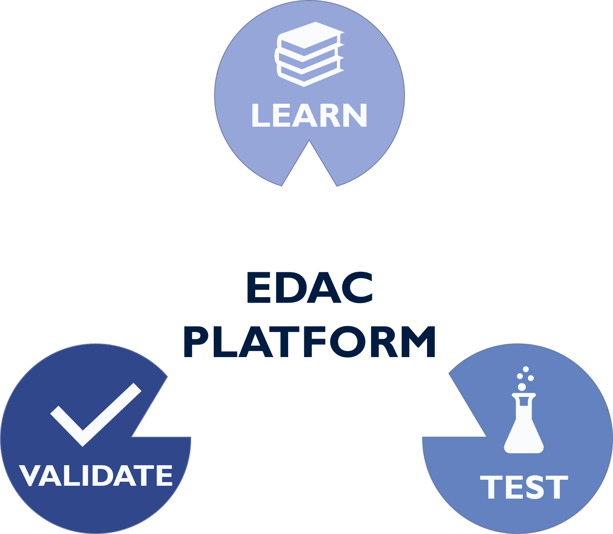
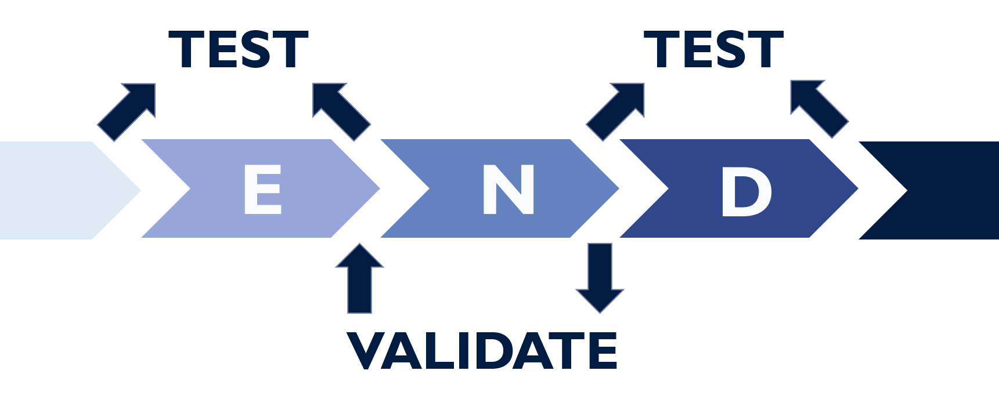

# A Test and Validation Platform for EDAC



A Learning Program for Error Decoding and Correction

# Intro

## What is EDAC

**In a nutshell:** 

A method that you can 

- Detect Error
- Correct Error

to your data

[A little more details](./tutorials/definitions/EDAC#edac)

## EDAC workflow


1. **Encode** -> encode your data with parities
2. **Noise** -> noises to your data occurs
3. **Decode** -> decode your data to identify errors and even correct them

## What EDAC Systems do we have

- [CRC](./sources/modules/edac/methods/crc/)
- [Hamming Code](./sources/modules/edac/methods/hammingcode/)
- [Parity Bit](./sources/modules/edac/methods/parity/)

## If you want to learn EDACs

- [CRC](./tutorials/ErrorDetection/crc/)
- [Hamming Code](./tutorials/ErrorDetection/hammingCode/)
- [Parity Bit](./tutorials/ErrorDetection/parity/)

# What can you do



## Learn

How to **decode**, **encode** or **correct** your EDAC message.

## Test

Your EDAC functions

## Validate

Your EDAC implementations


# Installations

## Before you run

```sh
git clone https://github.com/N0Ball/EDAC.git
python3 -m pip install -r requirements
```

## Web API

```sh
export FLASK_APP=server/web/server:app
flask run
```

## Docs
[Documentations](https://n0ball.github.io/EDAC)

```sh
make view-docs # Open a server to view documentation
make build-docs # Auto create docs from code
make deploy-docs # Create doc on github page
```